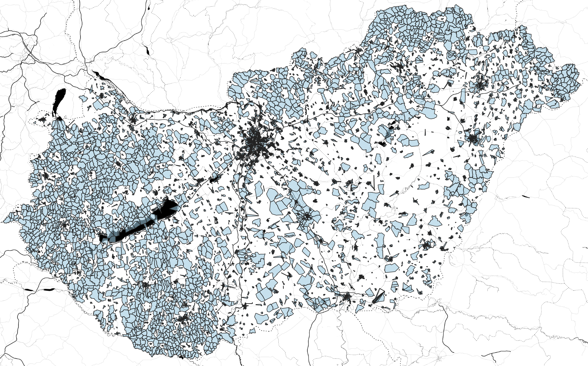

# Mi ez?

A 2019-es önkormányzati választás egyes adatai. A valasztas.hu-ról összegyűjtve (2019. október 15-18 között készült, ennek megfelelő állapotokat tükröz). Kutatási / ábrázolási célra hasznos.

# Adatok

A repo-ban két adatfájl található:
* a `onkorm_2019_polgarmester_szavazokoronkent.csv` a polgármesterekre leadott szavazatok adatait tartalmazza, szavazókörönként
* az adattábla formátuma a következő:


|    | megyeNev   | telepulesNev        |   megyeKod |   telepulesKod |   szavkorSorszam | jeloloSzervezet                | jeloltNev               |   szavazatSzam | szavazatAranySzavkorben   |
|---:|:-----------|:--------------------|-----------:|---------------:|-----------------:|:-------------------------------|:------------------------|---------------:|:--------------------------|
|  0 | BUDAPEST   | Budapest I. kerület |          1 |              1 |                1 | FIDESZ-KDNP                    | DR. NAGY GÁBOR TAMÁS    |            399 | 56,92%                    |
|  1 | BUDAPEST   | Budapest I. kerület |          1 |              1 |                1 | MOMENTUM-DK-MSZP-PÁRBESZÉD-LMP | VÁRADINÉ NASZÁLYI MÁRTA |            278 | 39,66%   

* a `onkorm_2019_szavazokorok_poligonok.geojson` pedig a szavazókörök földrajzi adatait tartalmazza poligonként, a szavazóköröket `megyeKod, telepulesKod, szavkorSorszam` mezőkkel azonosítva - ez összeköthetőséget biztosít a másik fájl adataival
* a fájl egy FeatureCollection geojson, beolvasva magukat a szavazóköröket a `['features']` property-n belül lehet elérni
* egy-egy feature a lent látható módon épül fel, a `proprties` részben a kódok az összeköthetőség miatt mindig kitöltöttek, a többi adat az esetek nagy részében

```
{'type': 'Feature',
 'geometry': {'type': 'Polygon',
  'coordinates': [[[20.66293716430664, 47.84231185913086],
    [20.667030334472656, 47.84423065185547],
    [20.674924850463867, 47.84282684326172],
    [20.674942016601562, 47.8427848815918],
    [20.674989700317383, 47.84278869628906],
    [20.674985885620117, 47.842674255371094],
    [20.6751708984375, 47.84220886230469],
    [20.67414093017578, 47.84709930419922],
    [20.677600860595703, 47.854000091552734],
    [20.680524826049805, 47.8572883605957],
    [20.68086051940918, 47.857269287109375],
    [20.678964614868164, 47.86191177368164],
    [20.67894744873047, 47.86212921142578],
    [20.67447280883789, 47.860679626464844],
    [20.673046112060547, 47.853515625],
    [20.671661376953125, 47.852935791015625],
    [20.66815948486328, 47.84479522705078],
    [20.66423797607422, 47.84292984008789],
    [20.66293716430664, 47.84231185913086]]]},
 'properties': {'szavkor': '',
  'telepulesKod': '198',
  'megyeKod': '5',
  'szavkorSorszam': '1',
  'megye': '',
  'nev': ''}}
```

A geojson fájl ábrázolva így néz ki:




# Hiányzó adatok

## Szavazókörök eredményei

Ahol hiányzik ott a sajtó források szerint vagy nem volt választás vagy nem szavazott senki (Újbuda) vagy teljesen meg kell ismételni a szavazást.


|    |   megyeKod |   telepulesKod |   szavkorSorszam | M_NEV                | value                |
|---:|-----------:|---------------:|-----------------:|:---------------------|:---------------------|
|  1 |          1 |             11 |              115 | BUDAPEST             | Budapest XI. kerület |
|  2 |          5 |            218 |                1 | BORSOD-ABAÚJ-ZEMPLÉN | Nyésta               |
|  3 |         19 |             31 |                1 | VESZPRÉM             | Balatonszepezd       |
|  4 |         20 |            107 |                1 | ZALA                 | Lakhegy              |

* (1) https://444.hu/2019/10/16/egy-ujbudai-szavazokorben-egyetlen-ember-sem-ment-el-valasztani
* (2) https://444.hu/2019/10/15/meg-kell-ismetelni-a-szavazast-egy-borsodi-faluban-mert-varatlanul-megtriplazodott-a-lakok-szama
* (3) https://vasarnap.hu/2019/10/13/ahol-nem-lesz-polgarmester-valasztas-balatonszepezd/
* (4) https://index.hu/belfold/2019/09/18/ket_telepules_polgarmesterjelolt_nelkul_maradt/

## Szavazókörök polygonjai

Ezeknél a szavazóköröknél jellemzően nincs megadva a körhöz tartozó terület poligonja a valasztas.hu-n.

|    |   megyeKod |   telepulesKod |   szavkorSorszam | M_NEV                  | value            |
|---:|-----------:|---------------:|-----------------:|:-----------------------|:-----------------|
|  0 |          3 |             67 |               10 | BÁCS-KISKUN            | Kiskunmajsa      |
|  1 |          6 |             24 |               51 | CSONGRÁD               | Hódmezővásárhely |
|  2 |          7 |             48 |                3 | FEJÉR                  | Kulcs            |
|  3 |          8 |             66 |                2 | GYŐR-MOSON-SOPRON      | Győrújfalu       |
|  4 |          8 |            172 |                2 | GYŐR-MOSON-SOPRON      | Vámosszabadi     |
|  5 |          8 |            150 |               50 | GYŐR-MOSON-SOPRON      | Sopron           |
|  6 |         14 |             36 |                4 | PEST                   | Ecser            |
|  7 |         14 |            147 |                7 | PEST                   | Tápiószecső      |
|  8 |         14 |             11 |                9 | PEST                   | Biatorbágy       |
|  9 |         14 |             11 |               10 | PEST                   | Biatorbágy       |
| 10 |         15 |             54 |                3 | SOMOGY                 | Fonyód           |
| 11 |         15 |             54 |                4 | SOMOGY                 | Fonyód           |
| 12 |         15 |            130 |                9 | SOMOGY                 | Nagyatád         |
| 13 |         16 |            119 |              101 | SZABOLCS-SZATMÁR-BEREG | Nyíregyháza      |
| 14 |         19 |            218 |                1 | VESZPRÉM               | Balatonakarattya |
